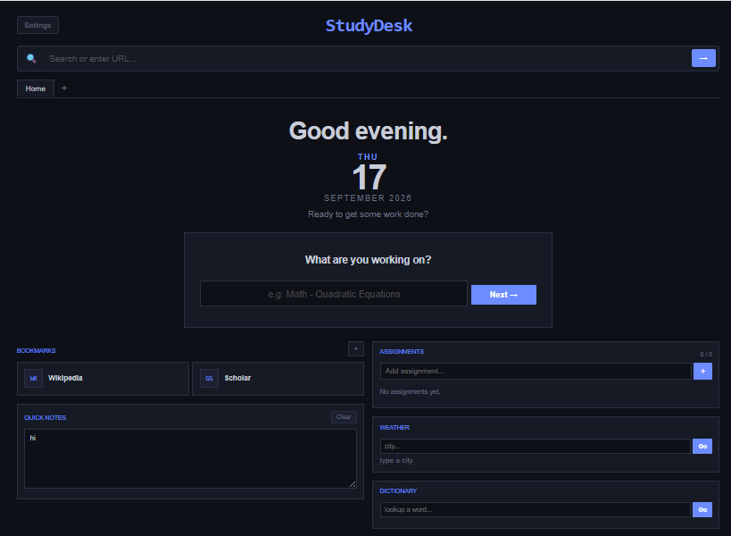

# StudyDesk

A new tab page for students. Set it as your browser's new tab and start working.



## features

### focus mode
A 4-step timer to keep you on track:
1. What are you working on?
2. How long? (hours + minutes)
3. Breaks? yes or no
4. Pick a reward (YouTube or gaming)

When the timer ends, open your reward in a new tab.

### assignments
Add tasks, check them off when done. Everything saves to your browser.

### quick notes
Jot down lecture notes, formulas, or ideas. Click clear to wipe it.

### weather
Type a city name, hit Go. Shows temperature, wind speed, and humidity.

### dictionary
Look up any word. Shows definitions and parts of speech.

### bookmarks
Wikipedia and Scholar are there by default. Add your own links with the + button.

### browser tabs
Search anything from the URL bar — it opens Google in an embedded tab. Rewards also open as embedded iframes.

### spotify
Plays focus music at the bottom of the page. Change the playlist by editing the iframe src in index.html.

### settings
Switch between dark and light theme.

## tech stack

- HTML, CSS, JavaScript (vanilla)
- Vite for dev server and builds
- GitHub Actions for auto-deploy
- APIs used:
  - [Open-Meteo](https://open-meteo.com/) — weather (free, no key)
  - [Wiktionary](https://www.wiktionary.org/) — dictionary (free, no key)
  - Spotify embed — embedded playlist player

## project structure

```
study/
├── index.html              # main page
├── src/
│   ├── main.js             # all app logic
│   └── style.css           # all styling
├── .env                    # env vars (not pushed)
├── .env.example            # template for env vars
├── vite.config.js          # vite config
├── package.json
└── .github/workflows/
    └── deploy.yml          # auto deploy to GitHub Pages
```

## local development

```bash
git clone https://github.com/muhammad-bin-junaid/study.git
cd study
npm install
npm run dev
```

Open http://localhost:5173 in your browser.

## environment variables

Create a `.env` file in the project root:

```
VITE_WEATHER_API=https://geocoding-api.open-meteo.com
VITE_DICT_API=https://en.wiktionary.org/api/rest_v1
```

These are public APIs so no real secret keys are needed. The `.env` setup is here to demonstrate secure env var practices with Vite.

## deploy

The project auto-deploys to GitHub Pages on every push to `main`. To deploy manually:

```bash
npm run build
```

The output goes to the `dist/` folder.

## live site

[https://muhammad-bin-junaid.github.io/study/](https://muhammad-bin-junaid.github.io/study/)
